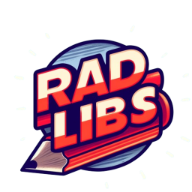

# Rad Libs

Rad Libs is an interactive web application that brings the classic Mad Libs game to the digital world. Users can fill in blanks in a story, and the completed story along with a relevant image is displayed on the results page.

## Technologies Used

- HTML5
- CSS3
- JavaScript
- Local Browser Storage
- [Mad Libs API](https://github.com/chroline/madlibs-api)
- [Unsplash API](https://unsplash.com/developers)

## Screenshots

## Deployment

The Rad Libs application is deployed on GitHub Pages. You can access it [here](https://mmhilbert.github.io/madlibs-project/).

## User Story

As a user, I want to play an interactive Mad Libs-style game where I can fill in blanks to create a funny story. I also want to see a relevant image alongside the completed story.

## Motivation for Development

We developed Rad Libs to create a fun and engaging way for users to interact with classic Mad Libs stories in a digital format. By incorporating relevant images, we aimed to enhance the user experience and add visual interest to the stories.

## Process

### Technologies

- We used HTML, CSS, and JavaScript to build the frontend of the application.
- We used JavaScript for DOM manipulation and event handling.
- We used local browser storage to store the image URL and story.
- We integrated the Mad Libs API to fetch stories and blanks dynamically.
- The Unsplash API was used to retrieve relevant images based on the story title.

### Task Breakdown

- Nick Sokolowski: Frontend development (navbar), CSS styling, API integration, Javascript form validation
- Larry Logan: Backend integration with APIs, JavaScript functionality
- Meg Hilbert: Design, UX/UI, logo creation
- Tom Burzynski: Backend integration with APIs, JavaScript functionality, README creation

### Challenges

- Integrating multiple APIs and ensuring data consistency
- Implementing responsive design across different screen sizes
- Coordinating tasks and ensuring collaboration within the group

### Successes

- Successfully retrieving and displaying dynamic content from APIs
- Creating an intuitive user interface with engaging visuals
- Deploying a polished and functional application on GitHub Pages

## Future Development

Future updates to Rad Libs could include:

- Allowing users to attempt the same story over again
- Implementing user accounts to save favorite stories or track progress
- Enhancing the image selection algorithm to provide more relevant and diverse visuals

## Contributors

- Tom Burzynski
- Meg Hilbert
- Larry Logan
- Nick Sokolowski

## Acknowledgements

Special thanks to our instructor Josh Naylor and the teaching assistants at the UW Coding Bootcamp for their guidance and support throughout the development process.
